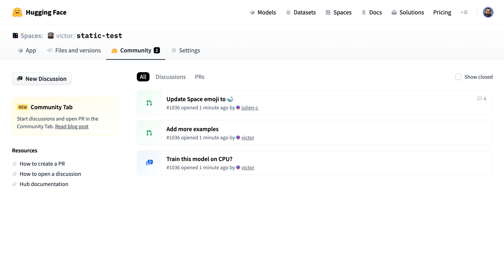
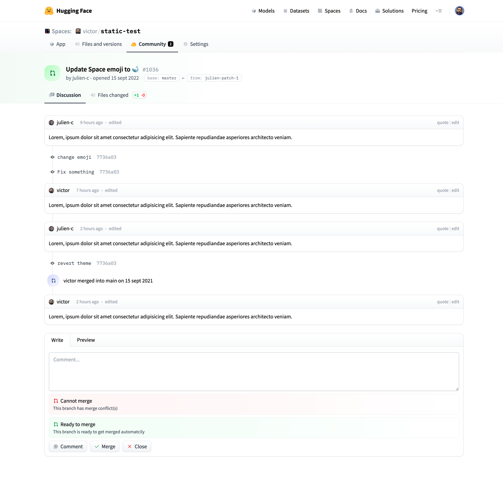

# Pull requests and Discussions

We just enabled **community contributions to repos**, a feature we call 'Hub Pull requests and Discussions'.

Pull requests and discussions work the same for all our repo types: models, datasets, and Spaces.

At a high level, we aim to build a simpler version of other git hosts' (like GitHub's) PRs and Issues:
- no forks are involved, contributors push to a special `ref` branch directly on the source repo
- there's no hard distinction between discussions and PRs they are essentially the same so we display them in the same lists
- they are streamlined for ML (i.e. models/datasets/spaces repos), not arbitrary repos

## List

## View

## Programmatic access

Coming soon in https://github.com/huggingface/huggingface_hub 🔥🔥

## FAQ

- Read more on [Advanced usage of pull requests](./repositories-pull-requests-advanced.md)
