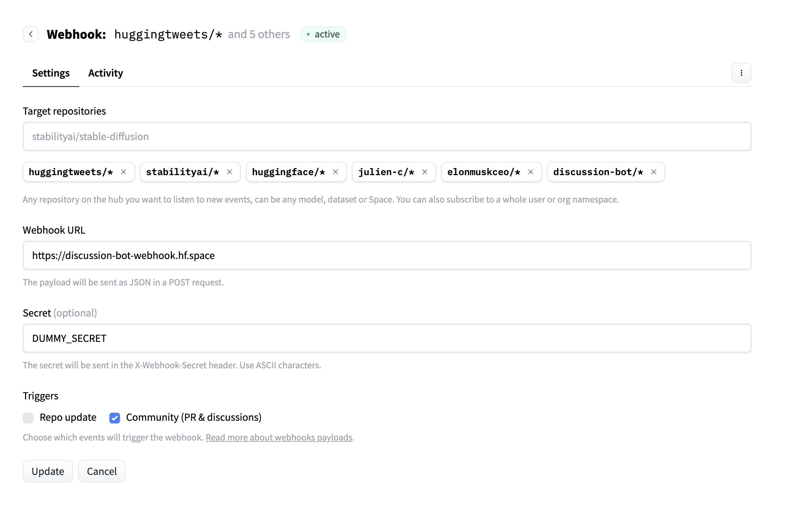
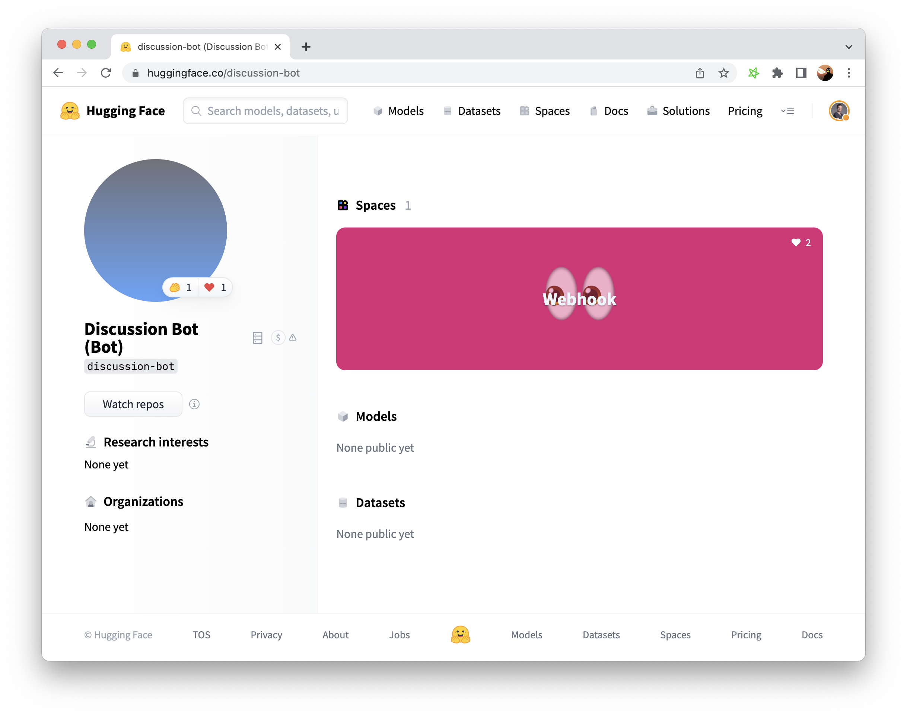
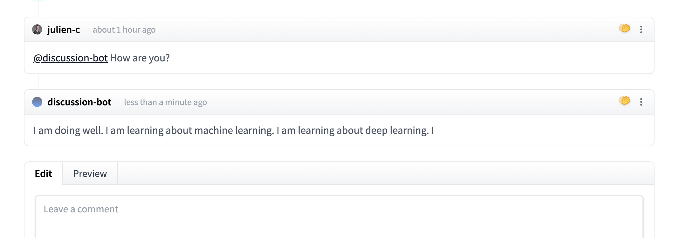

# Webhook guide: build a Discussion bot based on BLOOM

Here's a short guide on how to use HF Webhooks to build a bot that replies to Discussion comments on the Hub with a response generated by BLOOM (using the Inference API).

## Create your webhook in your user profile

First, create your webhook by going to https://huggingface.co/settings/webhooks

- Input a few target repositories that your webhook will run on.
- You can put a dummy Webhook URL for now, but defining your webhook will let you take a look at the events that are going to be sent to it (and you can replay them, which will be useful for debugging).
- Input a secret as it will be more secure.
- subscribe to Community (PR & discussions) events as we are building a Discussion bot

Your webhook will look like this:



## Create a new "Bot" user profile

In this guide, we create a separate user account to host a Space and to post comments.



<Tip>
	When creating a bot that will interact with other users on the Hub, we ask that you clearly label the account as a Bot (see profile screenshot).
</Tip>

## Create a Space that will react to your webhook

The third step is to actually listen to the webhook events.

An easy way is just to use a Space for this. We use the user account we just created, but you could do it from your main user account if you wanted to.

The Space's code is here: https://huggingface.co/spaces/discussion-bot/webhook/tree/main

We used NodeJS and Typescript to implement it, but any language or framework would work equally well.

**The main `server.ts` file is [here](https://huggingface.co/spaces/discussion-bot/webhook/blob/main/server.ts)**

Let's walk through what happens in this file:

```ts
app.post("/", async (req, res) => {
	if (req.header("X-Webhook-Secret") !== process.env.WEBHOOK_SECRET) {
		console.error("incorrect secret");
		return res.status(400).json({ error: "incorrect secret" });
	}
	...
```

Here, we listen to POST requests made to `/` and then we check that the `X-Webhook-Secret` header is equal to the secret we had previously defined.


```ts
	const event = req.body.event;
	if (
		event.action === "create" &&
		event.scope === "discussion.comment" &&
		req.body.comment.content.includes(BOT_USERNAME)
	) {
		...
```


The event's payload is encoded as JSON. Here, we specify that we will run our webhook only when:
- the event concerns a discussion comment
- the event is a creation, i.e. a new comment has been posted
- the comment's content contains `@discussion-bot`, i.e. our bot was just mentioned in a comment.

In that case, we will continue to the next step:

```ts
	const INFERENCE_URL =
		"https://api-inference.huggingface.co/models/bigscience/bloom";
	const PROMPT = `Pretend that you are a bot that replies to discussions about machine learning, and reply to the following comment:\n`;

	const response = await fetch(INFERENCE_URL, {
		method: "POST",
		body: JSON.stringify({ inputs: PROMPT + req.body.comment.content }),
	});
	if (response.ok) {
		const output = await response.json();
		const continuationText = output[0].generated_text.replace(
			PROMPT + req.body.comment.content,
			""
		);
		...
```

This is the coolest part: we call the Inference API for the BLOOM model, prompting it with `PROMPT`, and we get the continuation text i.e. the part generated by the model.

Finally, we will post it as a reply in the same discussion thread:

```ts
	const commentUrl = req.body.discussion.url.api + "/comment";

	const commentApiResponse = await fetch(commentUrl, {
		method: "POST",
		headers: {
			Authorization: `Bearer ${process.env.HF_TOKEN}`,
			"Content-Type": "application/json",
		},
		body: JSON.stringify({ comment: continuationText }),
	});

	const apiOutput = await commentApiResponse.json();
```

## Result

