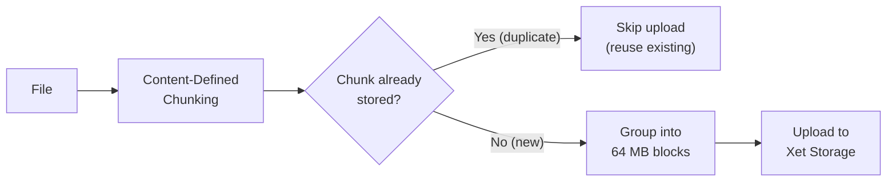

# Deduplication

Xet-enabled repositories utilize [content-defined chunking (CDC)](https://huggingface.co/blog/from-files-to-chunks) to deduplicate on the level of bytes (~64KB of data, also referred to as a "chunk"). Each chunk is identified by a rolling hash that determines chunk boundaries based on the actual file contents, making it resilient to insertions or deletions anywhere in the file. When a file is uploaded to a Xet-backed repository using a Xet-aware client, its contents are broken down into these variable-sized chunks. Only new chunks not already present in Xet storage are kept after chunking, everything else is discarded.

## How Content-Defined Chunking Works

To understand content-defined chunking, imagine a file as a long passage of text. The system scans the data using a rolling hash — a small mathematical function that slides over the bytes. Whenever the hash hits a special pattern, a chunk boundary is placed at that position. Because the boundaries are determined by the *content itself* (not by fixed positions), identical regions of data always produce the same chunks, even if surrounding content changes.

### Why Not Fixed-Size Chunks?

Consider what happens when you insert a small amount of data in the middle of a file. With fixed-size chunking, every chunk boundary after the insertion shifts, invalidating all downstream chunks — even though most of the data is unchanged:

```text
Original file, fixed 6-byte chunks:

  |The qu|ick br|own fo|x jump|s over| the l|azy do|g     |
  chunk1  chunk2 chunk3 chunk4 chunk5 chunk6 chunk7 chunk8

Insert "very " before "lazy":

  |The qu|ick br|own fo|x jump|s over| the v|ery la|zy dog|
  chunk1  chunk2 chunk3 chunk4 chunk5 chunk6 chunk7 chunk8
                                       ~~~~~~ ~~~~~~ ~~~~~~
                                        3 chunks changed!
```

Even though only 5 bytes were inserted, **3 out of 8 chunks changed** because all boundaries after the edit shifted by 5 positions. In real files at a 64KB chunk size, a small edit can invalidate hundreds of megabytes of chunks.

### Content-Defined Chunking Keeps Boundaries Stable

With CDC, boundaries are placed where the *content* matches a pattern — not at fixed intervals. This means an insertion only affects the chunk where the edit occurs. Chunks before and after remain identical:

```text
Original file, content-defined chunks (boundaries marked by "|"):

  |The quick |brown fox |jumps over |the lazy dog|
    chunk 1     chunk 2    chunk 3     chunk 4

Insert "very " before "lazy":

  |The quick |brown fox |jumps over |the very lazy dog|
    chunk 1     chunk 2    chunk 3     chunk 4'
    (same)      (same)     (same)      (changed)
```

Only **1 out of 4 chunks changed** — the one containing the edit. The other three are byte-for-byte identical and are deduplicated. This is why CDC is so effective for versioned data: when you update a model checkpoint or append rows to a dataset, only the modified portions need to be uploaded and stored.

### From Chunks to Storage

The full deduplication pipeline works as follows:


```mermaid
flowchart LR
    A["File"] --> B["Content-Defined\nChunking"]
    B --> C{"Chunk already\nstored?"}
    C -- "Yes (duplicate)" --> D["Skip upload\n(reuse existing)"]
    C -- "No (new)" --> E["Group into\n64 MB blocks"]
    E --> F["Upload to\nXet Storage"]
```

When a file is chunked, each chunk's hash is checked against what is already stored. This happens at multiple levels: first against chunks already seen in the current upload session, then against a local cache of previously uploaded metadata, and finally a subset of chunks are checked against all of Xet storage via a global deduplication query. Duplicate chunks are skipped entirely. New chunks are grouped into 64 MB blocks and uploaded. Each block is stored once in a content-addressed store (CAS), keyed by its hash.

## Storage Savings in Practice

The Hub's [current recommendation](https://huggingface.co/docs/hub/storage-limits#recommendations) is to limit files to 200 GB. At a 64KB chunk size, a 20GB file has 312,500 chunks, many of which go unchanged from version to version. Git LFS is designed to notice only that a file has changed and store the entirety of that revision. By deduplicating at the level of chunks, the Xet backend enables storing only the modified content in a file (which might only be a few KB or MB) and securely deduplicates shared blocks across repositories. For the large binary files found in Model and Dataset repositories, this provides significant improvements to file transfer times.

For more details, refer to the [From Files to Chunks](https://huggingface.co/blog/from-files-to-chunks) and [From Chunks to Blocks](https://huggingface.co/blog/from-chunks-to-blocks) blog posts, or the [Git is for Data](https://www.cidrdb.org/cidr2023/papers/p43-low.pdf) paper by Low et al. that served as the launch point for XetHub prior to being acquired by Hugging Face.

