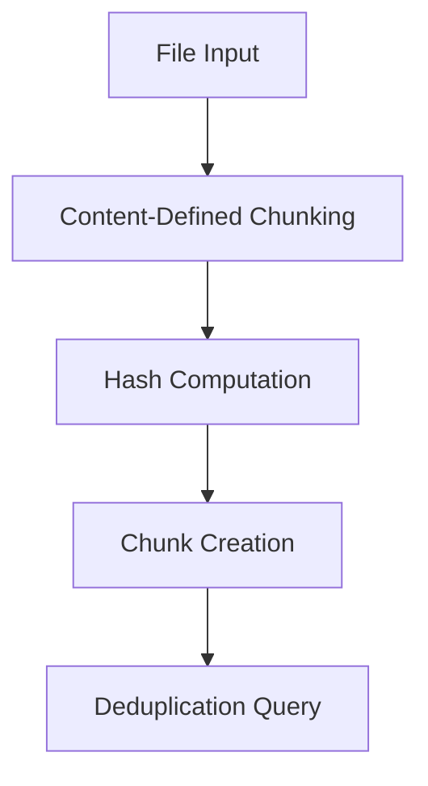

# Xet Chunk-Level Deduplication Specification

## Overview

Chunk-level deduplication is a fundamental optimization technique in the Xet system that eliminates redundant data by identifying and sharing identical content blocks (chunks) across files and repositories.
This specification details the procedures, algorithms, and security mechanisms that enable efficient storage and transfer while maintaining data integrity and access control.

Deduplication in Xet operates at the chunk level rather than the file level, providing fine-grained deduplication capabilities that can identify shared content even when files differ significantly.
This approach is particularly effective for scenarios common in machine learning and data science workflows, such as:

- Multiple versions of datasets with incremental changes
- Model checkpoints that share common layers or parameters
- Documentation and configuration files with similar content
- Large files where only portions have changed between versions

## Core Concepts

### Chunks

A **chunk** is a variable-sized content block derived from files using Content-Defined Chunking (CDC) with a rolling hash function. Chunks are the fundamental unit of deduplication in Xet.

- **Target size**: 64KB (configurable)
- **Size range**: 8KB to 128KB (minimum and maximum constraints)
- **Identification**: Each chunk is uniquely identified by its cryptographic hash (MerkleHash)

[Detailed chunking description](./chunking)

### Xorbs

**Xorbs** are objects that aggregate multiple chunks for efficient storage and transfer:

- **Maximum size**: 64MB
- **Maximum chunks**: 8,192 chunks per xorb
- **Purpose**: Batch multiple chunks together to reduce metadata and network overhead when uploading and downloading groups of chunks

### Shards (Xorb Lists)

**Shards** are objects that contain a list of xorbs that can be deduped against (for the context of deduplication, ignore the file info section of the shard format).

- **Maximum size**: 64MB
- **Purpose**: Provide a format on a positive reply to a global deduplication request with information about xorbs that already exist in the CAS system.

### CAS (Content Addressable Storage)

The **CAS** system provides the underlying storage infrastructure:

- **Content addressing**: All objects are stored and retrieved by their cryptographic hash
- **Immutability**: Once stored, file content cannot be modified
- **Deduplication**: Identical content is automatically deduplicated at the storage level

## Deduplication Procedure

### 1. File Processing and Chunking

When a file is processed for upload, it undergoes the following steps:

1. **Chunking**: Content-defined chunking using GearHash algorithm creates variable-sized chunks of file data
2. **Hash Computation**: Each chunk's content is hashed using a cryptographic hash function (Blake3-based MerkleHash)
3. **Chunk Object Creation**: Chunks are wrapped with metadata including hash, size, and data

### 2. Multi-Level Deduplication Strategy

Xet employs a three-tiered deduplication strategy to maximize efficiency while minimizing latency:

#### Level 1: Local Session Deduplication

**Scope**: Current upload session
**Mechanism**: In-memory hash lookup table
**Purpose**: Eliminate redundancy within the current file or session

**Benefits**:

- Fastest lookup (in-memory)
- Zero network overhead
- Immediate deduplication feedback

#### Level 2: Cached Metadata Deduplication

**Scope**: Previously uploaded files and sessions
**Mechanism**: Local shard file metadata cache
**Purpose**: Leverage deduplication against recently uploaded content

**Benefits**:

- Fast local disk access
- No network latency
- Persistent across sessions

#### Level 3: Global Deduplication API

**Scope**: Entire Xet system
**Mechanism**: Global deduplication service with HMAC protection
**Purpose**: Discover deduplication opportunities across all users and repositories

### 3. Global Deduplication Process

The global deduplication system provides deduplication capabilities across all data that is managed by the Xet system:

#### Eligibility Criteria

Not all chunks are eligible for global deduplication queries to manage system load:

1. **First chunk**: The first chunk of every file is always eligible.
2. **Hash pattern matching**: Chunks are eligible if: the last 8 bytes of the hash interpreted as a little-endian 64 bit integer % 1024 == 0.

**Recommendations:**
**Spacing constraints**: The global dedupe API is optimized to return information about nearby chunks when there is a match. Consider only issueing a request to an eligible chunk every ~4MB of data.

#### Query Process

1. **Background Query**: Global deduplication queries SHOULD run asynchronously to avoid blocking upload
2. **HMAC Protection**: Chunk hashes are protected using HMAC keys
3. **Shard Response**: When a match is found, the API returns a shard containing:
   - **CAS Info Section**: Contains metadata about many xorbs that store chunks
   - **HMAC Key**: Included in the shard metadata header used to encrypt chunk hashes
4. **Encrypted Chunk Matching**: All chunk hashes in the returned shard have been encrypted with the HMAC key
5. **Match Discovery Process**: To find matches, clients MUST:
   - Encrypt their chunk hash using the provided HMAC key
   - Search for the encrypted hash within the shard's chunk listings
   - For subsequent chunks, repeat the encryption and search process
   - Track the original (non-encrypted) chunk hash while noting which xorb contains that chunk
6. **Metadata Caching**: Client downloads and caches shard metadata for future deduplication

#### HMAC Security Mechanism

Global deduplication uses HMAC (Hash-based Message Authentication Code) to protect chunk hashes while enabling deduplication.

**Security Properties**:

Raw chunk hashes are never transmitted from servers to clients; a client has to encrypt their raw chunk hash and find a match to know a raw chunk hash exists in the system.
They MAY know this chunk hash because they own this data, the match has made them privy to know which xorb has this chunk hash and the position in the xorb, but has not revealed any other raw chunk hashes in that xorb or other xorbs.

## Technical Implementation Details

### Chunk Hash Computation

Each chunk has its content hashed using a cryptographic hash function (Blake3-based MerkleHash) to create a unique identifier for content addressing.
[See section about hashing](./hashing#chunk-hashes).

### Xorb Formation

When new chunks need to be stored, they are aggregated into xorbs based on size and count limits. If adding a new chunk would exceed the maximum xorb size or chunk count, the current xorb is finalized and uploaded. [See section about xorb formation](./xorb)

### File Reconstruction Information

When chunks are deduplicated, the system creates file reconstruction information that includes:

- Hash of the xorb containing the chunks
- Flags for the CAS block
- Total bytes in the segment
- Start and end indices within the xorb (start inclusive, end exclusive)

This information allows the system to reconstruct files by:

1. Identifying which xorbs contain the needed chunks
2. Extracting the specific chunk ranges from each xorb
3. Concatenating chunks in the correct order

[See section about file reconstruction](./file-reconstruction).

## Fragmentation Prevention

While deduplication is valuable for saving space, doing it too aggressively can cause file fragmentation—meaning a file’s chunks end up scattered across many different xorbs. This can make reading files slower and less efficient.
To avoid this, in xet-core we aim (and encourage implementors) to keep long, continuous runs of chunks together in the same xorb whenever possible. Implementations SHOULD keep long, continuous runs together when feasible.
Instead of always deduplicating every possible chunk, the system sometimes chooses to reference a straight run of chunks in a single xorb, even if it means skipping deduplication for a few chunks.
This approach balances the benefits of deduplication with the need to keep files easy and fast to read.
Consider for example referencing a deduplicated chunks in a minimum run of chunks (e.g. at least 8 chunks) or targeting an average contiguous run of chunks totalling length >= 1MB.

## Conclusion

Xet's chunk-level deduplication system provides a comprehensive solution for efficient data storage and transfer in large-scale data workflows.
By combining local, cached, and global deduplication strategies with robust security mechanisms and fragmentation prevention,
the system achieves significant storage savings while maintaining performance and data integrity.

The multi-tiered approach ensures that deduplication is both effective and efficient:

- Local deduplication provides immediate benefits within sessions
- Cached deduplication leverages recent upload history
- Global deduplication enables cross-repository optimization while preserving security

The system's design prioritizes both efficiency and safety, with comprehensive error handling, performance monitoring, and security measures that make it suitable for production use in data-intensive applications.
