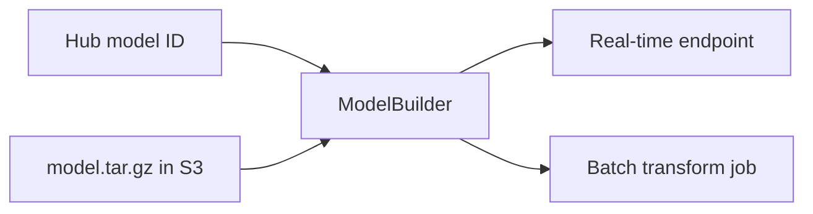

# Deploy models on Amazon SageMaker with the SageMaker SDK

Deploying 🤗 Transformers models in SageMaker for inference is as easy as:

```python
from sagemaker.serve import ModelBuilder

# build a Model with ModelBuilder and deploy it as a SageMaker endpoint
model_builder = ModelBuilder(...)
model_builder.build()
endpoint = model_builder.deploy()
```

This guide shows how to deploy models for inference with `ModelBuilder` from the SageMaker Python SDK. It covers the three serving paths: the zero-code [Inference Toolkit](https://github.com/aws/sagemaker-huggingface-inference-toolkit) for 🤗 Transformers models (built on the [`pipeline` feature](https://huggingface.co/docs/transformers/main_classes/pipelines)), the vLLM DLC for high-performance LLM serving, and batch transform for offline jobs. Make sure you have [set up the SageMaker SDK](./setup-sagemaker-sdk) first.



Learn how to:

- [Deploy a 🤗 Transformers model from the Hugging Face Hub](#deploy-a-model-from-the--hub).
- [Deploy a 🤗 Transformers model trained in SageMaker](#deploy-a--transformers-model-trained-in-sagemaker), directly after training or later from S3.
- [Deploy an LLM with the vLLM DLC](#deploy-an-llm-with-the-vllm-dlc).
- [Run a Batch Transform Job using 🤗 Transformers and Amazon SageMaker](#run-batch-transform-with--transformers-and-sagemaker).
- [Create a custom inference module](#user-defined-code-and-modules).

## Deploy a model from the 🤗 Hub

The [Quickstart](./sagemaker-sdk-quickstart) walks this same path end to end in a few minutes; this section explains what each piece does.

To deploy a model directly from the 🤗 Hub to SageMaker, pass the model ID as the `model` argument and the task via the `HF_TASK` environment variable when you create a `ModelBuilder`:

- `model` is the model ID, automatically loaded from [huggingface.co/models](http://huggingface.co/models) when you create a SageMaker endpoint (ModelBuilder sets the `HF_MODEL_ID` environment variable from it).
- `HF_TASK` defines the task for the 🤗 Transformers `pipeline`. A complete list of tasks can be found [here](https://huggingface.co/docs/transformers/main_classes/pipelines).

> [!WARNING]
> Pipelines are not optimized for parallelism (multi-threading) and tend to consume a lot of RAM. For example, on a GPU-based instance, the pipeline operates on a single vCPU. When this vCPU becomes saturated with the inference requests preprocessing, it can create a bottleneck, preventing the GPU from being fully utilized for model inference. Learn more [here](https://huggingface.co/docs/transformers/en/pipeline_webserver#using-pipelines-for-a-webserver).

```python
import json
from sagemaker.serve import ModelBuilder, ModelServer
from sagemaker.serve.builder.schema_builder import SchemaBuilder
from sagemaker.core import image_uris
from sagemaker.core.helper.session_helper import Session, get_execution_role

# set up the SageMaker session and execution role
sess = Session()
role = get_execution_role()

# model ID from hf.co/models
model_id = "cardiffnlp/twitter-roberta-base-sentiment-latest"
instance_type = "ml.m5.xlarge"

# Retrieve the Hugging Face PyTorch inference DLC image URI
inference_image = image_uris.retrieve(
    framework="huggingface",
    region=sess.boto_region_name,
    # Transformers version
    version="4.51.3",
    # PyTorch version
    base_framework_version="pytorch2.6.0",
    # Python version
    py_version="py312",
    image_scope="inference",
    instance_type=instance_type,
)

# sample input/output used by ModelBuilder to set up request/response serialization
sample_input = {"inputs": "I love how simple this was!"}
sample_output = [{"label": "positive", "score": 0.99}]

# Pass the model ID as `model` (ModelBuilder sets HF_MODEL_ID from it) and serve it with the
# Hugging Face Inference Toolkit. `HF_TASK` tells the toolkit which pipeline to build.
model_builder = ModelBuilder(
    model=model_id,
    model_server=ModelServer.MMS,
    image_uri=inference_image,
    env_vars={"HF_TASK": "text-classification"},
    # IAM role with permissions to create an endpoint
    role_arn=role,
    sagemaker_session=sess,
    instance_type=instance_type,
    schema_builder=SchemaBuilder(sample_input=sample_input, sample_output=sample_output),
)
model_builder.build()

# deploy model to SageMaker Inference
predictor = model_builder.deploy(
    initial_instance_count=1,
    instance_type="ml.m5.xlarge",
)

# example request: you always need to define "inputs"
data = {"inputs": "I love how simple this was!"}

# request
res = predictor.invoke(body=json.dumps(data), content_type="application/json")
print(json.loads(res.body.read()))
```

The remaining sections on this page reuse `sess`, `role`, and `inference_image` from this example; each snippet shows only what it changes.

After you run your request, you can delete the endpoint again with:

```python
# delete endpoint
predictor.delete()
```

## Deploy a 🤗 Transformers model trained in SageMaker

There are two ways to deploy your Hugging Face model trained in SageMaker:

- Deploy it after your training has finished. 
- Deploy your saved model at a later time from S3 with the `model_data`.

### Deploy after training

To deploy your model directly after training, the training script must save everything the endpoint needs — model and tokenizer. The training script from the [Train models guide](./training-sagemaker-sdk) already does this with `trainer.save_model()` and `save_pretrained()`.

```python
import json
from sagemaker.serve import ModelBuilder

# model_trainer is the completed ModelTrainer from the Train models guide
model_data = model_trainer._latest_training_job.model_artifacts.s3_model_artifacts

# build a Model from the trained artifacts and deploy it to SageMaker Inference
model_builder = ModelBuilder(
    # Hugging Face inference DLC, from the Hub example above
    image_uri=inference_image,
    s3_model_data_url=model_data,
    role_arn=role,
    sagemaker_session=sess,
    instance_type="ml.m5.xlarge",
)
model_builder.build()
predictor = model_builder.deploy(initial_instance_count=1, instance_type="ml.m5.xlarge")

# example request: you always need to define "inputs"
res = predictor.invoke(body=json.dumps({"inputs": "SageMaker is pretty cool"}), content_type="application/json")
print(json.loads(res.body.read()))
```

After you run your request you can delete the endpoint as shown:

```python
# delete endpoint
predictor.delete()
```

### Deploy with `model_data`

If you've already trained your model and want to deploy it at a later time, use the `s3_model_data_url` argument to specify the location of your tokenizer and model weights.

```python
import json
from sagemaker.serve import ModelBuilder

# reuses sess, role, and inference_image from the Hub example above

# create a ModelBuilder pointing at your trained model artifacts
model_builder = ModelBuilder(
    image_uri=inference_image,
    # path to your trained SageMaker model
    s3_model_data_url="s3://models/my-bert-model/model.tar.gz",
    # IAM role with permissions to create an endpoint
    role_arn=role,
    sagemaker_session=sess,
    instance_type="ml.m5.xlarge",
)
model_builder.build()

# deploy model to SageMaker Inference
predictor = model_builder.deploy(
    initial_instance_count=1,
    instance_type="ml.m5.xlarge",
)

# example request: you always need to define "inputs"
data = {"inputs": "SageMaker is pretty cool"}

# request
res = predictor.invoke(body=json.dumps(data), content_type="application/json")
print(json.loads(res.body.read()))
```

After you run your request, you can delete the endpoint again with:

```python
# delete endpoint
predictor.delete()
```

### Create a model artifact for deployment

For later deployment, you can create a `model.tar.gz` file that contains all the required files, such as:

- `model.safetensors`
- `config.json`
- `tokenizer.json`
- `tokenizer_config.json`

For example, your file should look like this:

```bash
model.tar.gz/
|- model.safetensors
|- config.json
|- tokenizer.json
|- tokenizer_config.json
|- special_tokens_map.json
```

Create your own `model.tar.gz` from a model from the 🤗 Hub:

1. Download a model:

```bash
git xet install
git clone git@hf.co:{repository}
```

2. Create a `tar` file:

```bash
cd {repository}
tar zcvf model.tar.gz *
```

3. Upload `model.tar.gz` to S3:

```bash
aws s3 cp model.tar.gz <s3://{my-s3-path}>
```

Now you can provide the S3 URI to the `model_data` argument to deploy your model later.

## Deploy an LLM with the vLLM DLC

For high-performance LLM serving, use the Hugging Face vLLM DLC. [vLLM](https://docs.vllm.ai/) serves most text-generation architectures on the Hub with high throughput and memory efficiency, and exposes an OpenAI-compatible API. The DLC is available for GPU and AWS AI chips (Neuron) — browse all images on the [Available DLCs](../../get-started/dlcs#available-dlcs) page.

Retrieve the vLLM DLC image URI and deploy with `ModelBuilder`:

```python
from sagemaker.core.image_uris import retrieve
from sagemaker.serve import ModelBuilder, ModelServer

# reuses sess and role from the Hub example above

model_id = "Qwen/Qwen3-8B"
instance_type = "ml.g5.xlarge"

# Retrieve the Hugging Face vLLM inference DLC image URI
image_uri = retrieve(
    "huggingface-vllm",
    region=sess.boto_region_name,
    image_scope="inference",
    instance_type=instance_type,
)

env_vars = {
    # required so the container passes the SageMaker health check
    "SM_VLLM_HOST": "0.0.0.0",
    # required for gated models
    # "HF_TOKEN": "hf_...",
}

# Pass the model ID as `model` (ModelBuilder sets HF_MODEL_ID from it) and select the vLLM server.
model_builder = ModelBuilder(
    model=model_id,
    model_server=ModelServer.VLLM,
    image_uri=image_uri,
    env_vars=env_vars,
    # IAM role with permissions to create an endpoint
    role_arn=role,
    sagemaker_session=sess,
    instance_type=instance_type,
)
model_builder.build()

predictor = model_builder.deploy(initial_instance_count=1, instance_type=instance_type)
```

Tune vLLM through environment variables: `SM_VLLM_MAX_MODEL_LEN` for the context length, `SM_VLLM_GPU_MEMORY_UTILIZATION` for the KV cache budget, and more — each maps to a vLLM engine argument. For a full configuration example, see the [trip planner agent with vLLM](../../examples/sagemaker-sdk-trip-planner-agent-vllm) example.

### Invoke the endpoint

The vLLM DLC exposes OpenAI-compatible routes. Send requests with the SageMaker runtime client and set the route in `CustomAttributes`:

```python
import json

runtime = sess.boto_session.client("sagemaker-runtime")

response = runtime.invoke_endpoint(
    EndpointName=predictor.endpoint_name,
    ContentType="application/json",
    Body=json.dumps({
        "model": model_id,
        "messages": [{"role": "user", "content": "What is the capital of France?"}],
    }),
    CustomAttributes="route=/v1/chat/completions",
)

print(json.loads(response["Body"].read())["choices"][0]["message"]["content"])
```

Once you are done experimenting, delete the endpoint:

```python
predictor.delete()
```

## Run batch transform with 🤗 Transformers and SageMaker

After training a model, you can use [SageMaker batch transform](https://docs.aws.amazon.com/sagemaker/latest/dg/how-it-works-batch.html) to perform inference with the model. Batch transform accepts your inference data as an S3 URI  and then SageMaker will take care of downloading the data, running the prediction, and uploading the results to S3. For more details about batch transform, take a look [here](https://docs.aws.amazon.com/sagemaker/latest/dg/batch-transform.html).

> [!WARNING]
> The Hugging Face Inference DLC currently only supports `.jsonl` for batch transform due to the complex structure of textual data.

> [!NOTE]
> Make sure your `inputs` fit the `max_length` of the model during preprocessing.

If you trained a model with a `ModelTrainer`, build a `ModelBuilder` from the trained artifacts and call its `transformer()` method to create a transform job:

```python
from sagemaker.serve import ModelBuilder

# build a Model from the trained artifacts
model_builder = ModelBuilder(
    image_uri=inference_image,
    s3_model_data_url=model_trainer._latest_training_job.model_artifacts.s3_model_artifacts,
    role_arn=role,
    sagemaker_session=sess,
)
model_builder.build()

batch_job = model_builder.transformer(
    instance_count=1,
    # matches the CPU inference image from the Hub example
    instance_type='ml.m5.xlarge',
    strategy='SingleRecord')


batch_job.transform(
    data='s3://s3-uri-to-batch-data',
    content_type='application/json',    
    split_type='Line')
```

If you want to run your batch transform job later or with a model from the 🤗 Hub, create a `ModelBuilder` and then call the `transformer()` method:

```python
from sagemaker.serve import ModelBuilder, ModelServer
from sagemaker.serve.builder.schema_builder import SchemaBuilder

# reuses sess, role, and inference_image from the Hub example above

model_id = "cardiffnlp/twitter-roberta-base-sentiment-latest"
instance_type = "ml.m5.xlarge"

# Pass the model ID as `model` (ModelBuilder sets HF_MODEL_ID) and serve it with the
# Hugging Face Inference Toolkit.
model_builder = ModelBuilder(
    model=model_id,
    model_server=ModelServer.MMS,
    image_uri=inference_image,
    env_vars={"HF_TASK": "text-classification"},
    # IAM role with permissions to create an endpoint
    role_arn=role,
    sagemaker_session=sess,
    instance_type=instance_type,
    schema_builder=SchemaBuilder(
        sample_input={"inputs": "this movie is terrible"},
        sample_output=[{"label": "negative", "score": 0.99}],
    ),
)
model_builder.build()

# create transformer to run a batch job
batch_job = model_builder.transformer(
    instance_count=1,
    instance_type=instance_type,
    strategy='SingleRecord'
)

# starts batch transform job and uses S3 data as input
batch_job.transform(
    data='s3://sagemaker-s3-demo-test/samples/input.jsonl',
    content_type='application/json',    
    split_type='Line'
)
```

The `input.jsonl` looks like this:

```jsonl
{"inputs":"this movie is terrible"}
{"inputs":"this movie is amazing"}
{"inputs":"SageMaker is pretty cool"}
{"inputs":"SageMaker is pretty cool"}
{"inputs":"this movie is terrible"}
{"inputs":"this movie is amazing"}
```

## User defined code and modules

The Hugging Face Inference Toolkit allows the user to override the default methods of the `HuggingFaceHandlerService`. You will need to create a folder named `code/` with an `inference.py` file in it. See [here](#create-a-model-artifact-for-deployment) for more details on how to archive your model artifacts. For example:  

```bash
model.tar.gz/
|- model.safetensors
|- ....
|- code/
  |- inference.py
  |- requirements.txt 
```

The `inference.py` file contains your custom inference module, and the `requirements.txt` file contains additional dependencies that should be added. The custom module can override the following methods:  

* `model_fn(model_dir)` overrides the default method for loading a model. The return value `model` will be used in `predict` for predictions. `predict` receives argument the `model_dir`, the path to your unzipped `model.tar.gz`.
* `transform_fn(model, data, content_type, accept_type)` overrides the default transform function with your custom implementation. You will need to implement your own `preprocess`, `predict` and `postprocess` steps in the `transform_fn`. This method can't be combined with `input_fn`, `predict_fn` or `output_fn` mentioned below.
* `input_fn(input_data, content_type)` overrides the default method for preprocessing. The return value `data` will be used in `predict` for predictions. The inputs are:
  - `input_data` is the raw body of your request.
  - `content_type` is the content type from the request header.
* `predict_fn(processed_data, model)` overrides the default method for predictions. The return value `predictions` will be used in `postprocess`. The input is `processed_data`, the result from `preprocess`.
* `output_fn(prediction, accept)` overrides the default method for postprocessing. The return value `result` will be the response of your request (e.g.`JSON`). The inputs are:
  - `predictions` is the result from `predict`.
  - `accept` is the return accept type from the HTTP Request, e.g. `application/json`.

Here is an example of a custom inference module with `model_fn`, `input_fn`, `predict_fn`, and `output_fn`:  

```python
from sagemaker_huggingface_inference_toolkit import decoder_encoder

def model_fn(model_dir):
    # implement custom code to load the model
    loaded_model = ...
    
    return loaded_model 

def input_fn(input_data, content_type):
    # decode the input data  (e.g. JSON string -> dict)
    data = decoder_encoder.decode(input_data, content_type)
    return data

def predict_fn(data, model):
    # call your custom model with the data
    outputs = model(data , ... )
    return predictions

def output_fn(prediction, accept):
    # convert the model output to the desired output format (e.g. dict -> JSON string)
    response = decoder_encoder.encode(prediction, accept)
    return response
```

Customize your inference module with only `model_fn` and `transform_fn`:   

```python
from sagemaker_huggingface_inference_toolkit import decoder_encoder

def model_fn(model_dir):
    # implement custom code to load the model
    loaded_model = ...
    
    return loaded_model 

def transform_fn(model, input_data, content_type, accept):
     # decode the input data (e.g. JSON string -> dict)
    data = decoder_encoder.decode(input_data, content_type)

    # call your custom model with the data
    outputs = model(data , ... ) 

    # convert the model output to the desired output format (e.g. dict -> JSON string)
    response = decoder_encoder.encode(output, accept)

    return response
```
