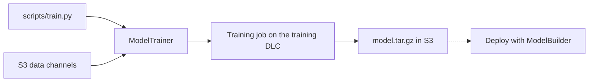

# Train models on Amazon SageMaker with the SageMaker SDK

This guide shows how to train models with the SageMaker Python SDK `ModelTrainer` and your own training script. Make sure you have [set up the SageMaker SDK](./setup-sagemaker-sdk) first.

The examples come from the [Fine-Tune an LLM with the SageMaker SDK and TRL](../../examples/sagemaker-sdk-fine-tune-llm-sft) example, which fine-tunes `Qwen/Qwen3-0.6B` with TRL `SFTTrainer` on the Hugging Face PyTorch training DLC. The example is the complete runnable version; this guide explains each concept.



Learn how to:

- [Prepare a training script](#prepare-a-training-script).
- [Create a ModelTrainer](#create-a-modeltrainer).
- [Start the training job](#start-the-training-job).
- [Manage training output and checkpoints](#training-output-and-checkpoints).
- [Access the trained model](#access-the-trained-model).
- [Scale to distributed training](#distributed-training).
- [Save with spot instances](#spot-instances).
- [Load a training script from a GitHub repository](#git-repository).
- [Collect training metrics](#sagemaker-metrics).

## Prepare a training script

A SageMaker training script is a regular Python script that reads two things from its environment: hyperparameters as command-line arguments, and directory locations as environment variables. The most useful environment variables (see the [full list](https://github.com/aws/sagemaker-training-toolkit/blob/master/ENVIRONMENT_VARIABLES.md)):

- `SM_MODEL_DIR`: the directory the job uploads to S3 as `model.tar.gz` when training finishes. Always `/opt/ml/model`.
- `SM_NUM_GPUS`: the number of GPUs available on the instance.
- `SM_CHANNEL_XXXX`: the path to the input data for channel `XXXX` when you pass data channels (see [Start the training job](#start-the-training-job)).

The notebook's `scripts/train.py`:

```python
import argparse
import os

from datasets import load_dataset
from trl import SFTConfig, SFTTrainer


def parse_args():
    parser = argparse.ArgumentParser()

    # hyperparameters sent by the ModelTrainer arrive as command-line arguments
    parser.add_argument("--model_name", type=str, default="Qwen/Qwen3-0.6B")
    parser.add_argument("--dataset_name", type=str, default="trl-lib/Capybara")
    parser.add_argument("--max_steps", type=int, default=50)
    parser.add_argument("--train_batch_size", type=int, default=4)
    parser.add_argument("--learning_rate", type=float, default=2e-5)

    # SageMaker directories: SM_MODEL_DIR is archived to S3 as model.tar.gz
    parser.add_argument("--model_dir", type=str, default=os.environ["SM_MODEL_DIR"])
    parser.add_argument("--output_dir", type=str, default=os.environ.get("SM_OUTPUT_DATA_DIR", "/opt/ml/output"))

    return parser.parse_args()


def main():
    args = parse_args()

    # the dataset downloads from the Hugging Face Hub inside the training container
    dataset = load_dataset(args.dataset_name, split="train")

    training_args = SFTConfig(
        output_dir=args.output_dir,
        max_steps=args.max_steps,
        per_device_train_batch_size=args.train_batch_size,
        learning_rate=args.learning_rate,
        logging_steps=5,
        # the final model is saved explicitly below
        save_strategy="no",
        report_to=[],
    )

    trainer = SFTTrainer(
        model=args.model_name,
        args=training_args,
        train_dataset=dataset,
    )
    trainer.train()

    # save the model and tokenizer where SageMaker expects them
    trainer.save_model(args.model_dir)
    trainer.processing_class.save_pretrained(args.model_dir)


if __name__ == "__main__":
    main()
```

> [!NOTE]
> SageMaker does not support argparse actions. For example, if you want a boolean hyperparameter, specify `type` as `bool` in your script and provide an explicit `True` or `False` value.

## Create a ModelTrainer

The `ModelTrainer` handles end-to-end SageMaker training. The most important parameters:

1. `source_code` specifies the training script (`entry_script`) and its directory (`source_dir`).
2. `compute` specifies the instance(s) to launch. Refer to [SageMaker pricing](https://aws.amazon.com/sagemaker/pricing/) for a complete list of instance types.
3. `training_image` is the training container image, retrieved with `image_uris.retrieve`.
4. `hyperparameters` are passed to the script as `--key value` command-line arguments.

```python
from sagemaker.core.helper.session_helper import Session, get_execution_role
from sagemaker.train.model_trainer import ModelTrainer
from sagemaker.train.configs import SourceCode, Compute, StoppingCondition
from sagemaker.core import image_uris

# set up the SageMaker session and execution role
sess = Session()
role = get_execution_role()

hyperparameters = {
    # any small causal LM from the Hub works
    "model_name": "Qwen/Qwen3-0.6B",
    # conversational SFT dataset
    "dataset_name": "trl-lib/Capybara",
    # short run: enough to see the loss go down
    "max_steps": 50,
    "train_batch_size": 4,
    "learning_rate": 2e-5,
}

instance_type = "ml.g6.xlarge"

# Retrieve the Hugging Face PyTorch training DLC image URI
training_image = image_uris.retrieve(
    framework="huggingface",
    region=sess.boto_region_name,
    # Transformers version
    version="5.3.0",
    # PyTorch version
    base_framework_version="pytorch2.9.0",
    # Python version
    py_version="py312",
    image_scope="training",
    instance_type=instance_type,
)

model_trainer = ModelTrainer(
    sagemaker_session=sess,
    role=role,
    training_image=training_image,
    source_code=SourceCode(
        # directory with the training script
        source_dir="./scripts",
        # script to run in the training job
        entry_script="train.py",
    ),
    compute=Compute(
        instance_type=instance_type,
        instance_count=1,
        # uncomment for managed spot instances (needs spot quota)
        # enable_managed_spot_training=True,
    ),
    stopping_condition=StoppingCondition(
        # safety cap on billable seconds
        max_runtime_in_seconds=3600,
    ),
    hyperparameters=hyperparameters,
)
```

If you are running a `TrainingJob` locally, define `instance_type='local'` or `instance_type='local_gpu'` for GPU usage. Note that this will not work with SageMaker Studio.

The sections below reuse `sess`, `role`, `training_image`, and `hyperparameters` from this example; each snippet shows only what it changes.

## Start the training job

Call `train` to launch the job:

```python
model_trainer.train()
```

SageMaker starts the instance, runs `train.py` with your hyperparameters, streams the logs, and uploads the model artifacts to S3 when the job finishes. The example script downloads its dataset from the Hub inside the container, so there is no data to upload.

If your data lives in S3, pass it as input channels instead. Each channel is mounted inside the container at `/opt/ml/input/data/<channel_name>` and exposed to your script as the `SM_CHANNEL_<channel_name>` environment variable:

```python
from sagemaker.train.configs import InputData

model_trainer.train(
    input_data_config=[
        InputData(channel_name="train", data_source="s3://<your-bucket>/dataset/train"),
        InputData(channel_name="test", data_source="s3://<your-bucket>/dataset/test"),
    ]
)
```

A channel `data_source` can be an S3 URI or a `FileSystemInput` for Amazon EFS or FSx for Lustre.

## Training output and checkpoints

If `output_dir` in the training arguments is set to `/opt/ml/model`, all training artifacts — logs, checkpoints, and models — are saved there. Amazon SageMaker archives the whole `/opt/ml/model` directory as `model.tar.gz` and uploads it to Amazon S3 at the end of the training job. Depending on your hyperparameters, this can lead to a large artifact (> 5GB), which slows down deployment for Amazon SageMaker Inference.

You can control how checkpoints, logs, and artifacts are saved by customizing the training arguments. For example, set `save_total_limit` to cap the number of checkpoints: older checkpoints in `output_dir` are deleted once the limit is reached.

To save artifacts continuously during training instead of only at the end, SageMaker supports [checkpointing](https://docs.aws.amazon.com/sagemaker/latest/dg/model-checkpoints.html): provide a `CheckpointConfig(s3_uri=...)` on the `ModelTrainer` and set `output_dir` to `/opt/ml/checkpoints`. In the example script, also switch `save_strategy` from `"no"` to `"steps"` so checkpoints are actually written.

> [!WARNING]
> If you set `output_dir` to `/opt/ml/checkpoints`, call `trainer.save_model("/opt/ml/model")` — or `model.save_pretrained("/opt/ml/model")` and `tokenizer.save_pretrained("/opt/ml/model")` — at the end of training. Otherwise the model artifacts are missing from `model.tar.gz` and the model cannot be deployed to Amazon SageMaker for inference.

## Access the trained model

Once training is complete, you can access your model through the [AWS console](https://console.aws.amazon.com/console/home?nc2=h_ct&src=header-signin) or download it directly from S3. The S3 URI of the trained model artifacts is available on the completed training job:

```python
import boto3
from urllib.parse import urlparse

# S3 URI where the trained model artifacts (model.tar.gz) are located
model_data = model_trainer._latest_training_job.model_artifacts.s3_model_artifacts

parsed = urlparse(model_data)
boto3.client("s3").download_file(
    # bucket
    parsed.netloc,
    # key
    parsed.path.lstrip("/"),
    # local path where the artifact is saved
    "model.tar.gz",
)
```

## Distributed training

SageMaker provides two strategies for distributed training: data parallelism and model parallelism. Data parallelism splits a training set across several GPUs, while model parallelism splits a model across several GPUs.

### Data parallelism

The Hugging Face `Trainer` and the TRL trainers support distributed data parallel training. With `ModelTrainer` you launch your script with `torchrun` by passing a `Torchrun` config to the `distributed` parameter. Set `process_count_per_node` to the number of GPUs per instance (`ml.g6e.12xlarge` has 4):

```python
from sagemaker.train.distributed import Torchrun

# reuses sess, role, training_image, and hyperparameters from the ModelTrainer example above

# 4x L40S GPUs
instance_type = "ml.g6e.12xlarge"

# create the ModelTrainer with torchrun for distributed data parallelism
model_trainer = ModelTrainer(
    sagemaker_session=sess,
    role=role,
    training_image=training_image,
    source_code=SourceCode(source_dir="./scripts", entry_script="train.py"),
    compute=Compute(instance_type=instance_type, instance_count=2),
    distributed=Torchrun(process_count_per_node=4),
    hyperparameters=hyperparameters,
)
```

### Model parallelism

For models too large for a single GPU, the SageMaker Model Parallelism library (SMP) provides tensor parallelism, context parallelism, and sharded data parallelism. Enable it by passing an `SMP` config to `Torchrun`:

```python
from sagemaker.train.distributed import Torchrun, SMP

# reuses sess, role, training_image, and hyperparameters from the ModelTrainer example above

# 8x A100 GPUs
instance_type = "ml.p4de.24xlarge"

# create the ModelTrainer with torchrun + SMP for model parallelism
model_trainer = ModelTrainer(
    sagemaker_session=sess,
    role=role,
    training_image=training_image,
    source_code=SourceCode(source_dir="./scripts", entry_script="train.py"),
    compute=Compute(instance_type=instance_type, instance_count=2),
    distributed=Torchrun(
        process_count_per_node=8,
        smp=SMP(
            tensor_parallel_degree=2,
            hybrid_shard_degree=1,
        ),
    ),
    hyperparameters=hyperparameters,
)
```

## Spot instances

Managed spot training uses [fully-managed EC2 spot instances](https://docs.aws.amazon.com/sagemaker/latest/dg/model-managed-spot-training.html) and can save up to 90% of training costs. Set `enable_managed_spot_training=True` on `Compute`, define `max_wait_time_in_seconds` and `max_runtime_in_seconds` on `StoppingCondition`, and enable checkpointing so an interrupted job can resume:

```python
from sagemaker.train.configs import StoppingCondition, CheckpointConfig

# reuses sess, role, and training_image from the ModelTrainer example above
# spot jobs can be interrupted, so the script must write checkpoints to /opt/ml/checkpoints
hyperparameters = {
    "model_name": "Qwen/Qwen3-0.6B",
    "dataset_name": "trl-lib/Capybara",
    "max_steps": 50,
    "train_batch_size": 4,
    "learning_rate": 2e-5,
    "output_dir": "/opt/ml/checkpoints",
}

model_trainer = ModelTrainer(
    sagemaker_session=sess,
    role=role,
    training_image=training_image,
    source_code=SourceCode(source_dir="./scripts", entry_script="train.py"),
    compute=Compute(
        instance_type="ml.g6.xlarge",
        instance_count=1,
        # use fully-managed spot instances
        enable_managed_spot_training=True,
    ),
    # max_wait_time_in_seconds should be equal to or greater than max_runtime_in_seconds
    stopping_condition=StoppingCondition(
        max_runtime_in_seconds=3600,
        max_wait_time_in_seconds=7200,
    ),
    checkpoint_config=CheckpointConfig(s3_uri=f"s3://{sess.default_bucket()}/checkpoints"),
    hyperparameters=hyperparameters,
)
```

> [!NOTE]
> Spot and on-demand quotas are separate, and new accounts can start with a spot limit of 0. If job creation fails with `ResourceLimitExceeded`, check your [SageMaker quotas](https://console.aws.amazon.com/servicequotas/home/services/sagemaker/quotas) or run on-demand.

## Git repository

The v2 `git_config` parameter is not available in `ModelTrainer`. To run a training script that lives in a GitHub repository (such as the [🤗 Transformers example scripts](https://github.com/huggingface/transformers/tree/main/examples)), clone the repository locally first and point `source_dir`/`entry_script` at the checked-out files. Choose a branch that matches the Transformers version of your training image.

> [!TIP]
> Save your model to S3 by setting `output_dir=/opt/ml/model` in the hyperparameters of your training script.

```bash
# clone the repo locally, matching the transformers version of your training image
git clone --branch v5.3.0 https://github.com/huggingface/transformers.git
```

```python
# reuses sess, role, and training_image from the ModelTrainer example above
# run_glue.py takes the Transformers example argument names
hyperparameters = {
    "epochs": 1,
    "per_device_train_batch_size": 32,
    "model_name_or_path": "distilbert-base-uncased",
}

# create the ModelTrainer pointing at the cloned example directory
model_trainer = ModelTrainer(
    sagemaker_session=sess,
    role=role,
    training_image=training_image,
    source_code=SourceCode(
        source_dir="transformers/examples/pytorch/text-classification",
        entry_script="run_glue.py",
        requirements="requirements.txt",
    ),
    compute=Compute(instance_type="ml.g6.xlarge", instance_count=1),
    hyperparameters=hyperparameters,
)
```

## SageMaker metrics

[SageMaker metrics](https://docs.aws.amazon.com/sagemaker/latest/dg/training-metrics.html#define-train-metrics) automatically parse training job logs and send metrics to CloudWatch. Specify each metric's name and a regular expression for SageMaker to match. With `ModelTrainer` you attach them using `with_metric_definitions`:

```python
from sagemaker.train.configs import MetricDefinition

# reuses sess, role, training_image, and hyperparameters from the ModelTrainer example above

# SFTTrainer logs lines like {'loss': 2.34, ...}; parse the loss into CloudWatch
metric_definitions = [
    MetricDefinition(name="train-loss", regex="'loss': ([0-9.]+)"),
]

model_trainer = ModelTrainer(
    sagemaker_session=sess,
    role=role,
    training_image=training_image,
    source_code=SourceCode(source_dir="./scripts", entry_script="train.py"),
    compute=Compute(instance_type="ml.g6.xlarge", instance_count=1),
    hyperparameters=hyperparameters,
).with_metric_definitions(metric_definitions)
```

## What's next

Once your training job is complete, the model artifacts are in S3 and ready for deployment. Continue with [Deploy models](./deploy-sagemaker-sdk#deploy-a--transformers-model-trained-in-sagemaker) to serve your trained model on a SageMaker endpoint.
