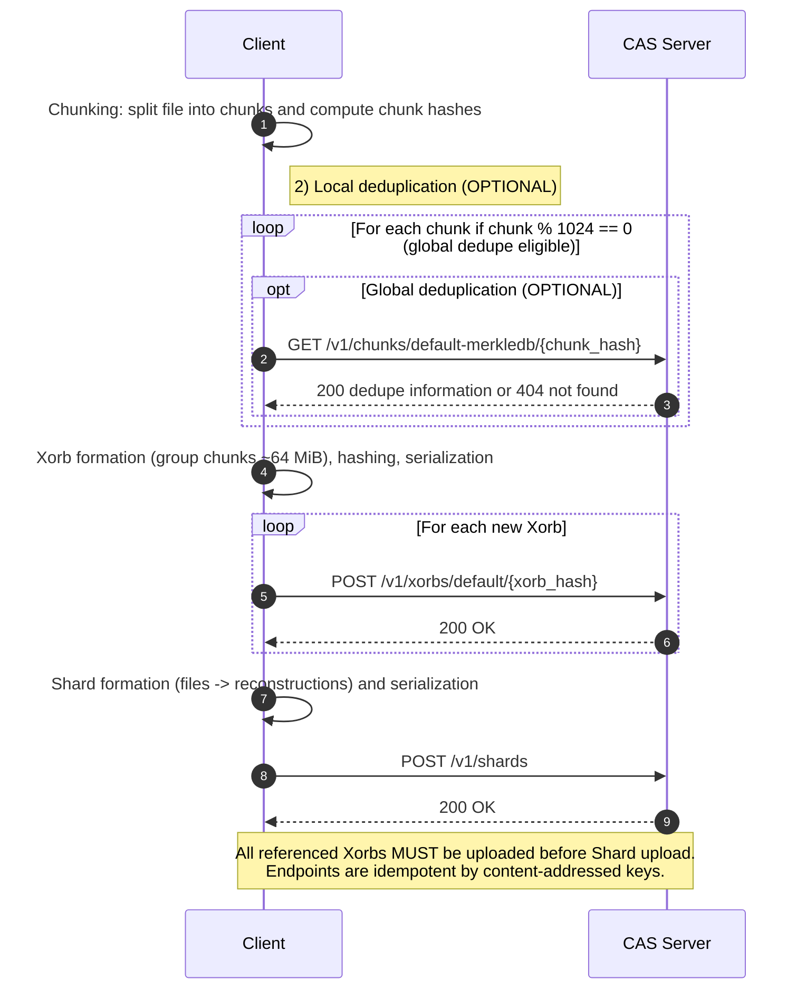

# Upload Protocol

This document describes how files are uploaded in the Xet protocol to the Content Addressable Storage (CAS) service.
The flow converts input files into chunks, applies deduplication, groups chunks into xorbs, uploads xorbs, then forms and uploads shards that reference those xorbs.
The steps can be done all be done concurrently except that all xorbs MUST be uploaded before a shard referencing them is uploaded.
Content addressing uses hashes as stable keys for deduplication and integrity verification.

## Xet Object Types

### Chunk

A chunk is a slice of data from a real file.

A chunk has an associated hash computed through the [chunk hashing process](./hashing#chunk-hashes) and its data is determined by finding chunk boundaries following the chunking algorithm defined in [chunking](./chunking).

A chunk is ~64KiB of data with a maximum of 128KiB and minimum of 8KiB.
However, the minimum chunk size limit is not enforced for the last chunk of a file or if the file is smaller than 8KiB.

### Xorb

A Xorb is composed of a sequence of chunks.

Chunks in a xorb are not simply concatenated but instead compressed and appended after a header as described in [xorb](./xorb#xorb-format).
Chunks are collected in a xorb for more efficient upload and downloads of "ranges" of chunks.
Each chunk has an associated index (beginning at 0) and chunks may addressed from xorbs using through an end exclusive chunk index range i.e. [0, 100).

Xorbs are created by grouping sequences of chunks from files and are referenced in file reconstructions to provide instructions to rebuild the file.

Xorbs have an associated hash computed according to the instructions for the [xorb hashing process](./hashing#xorb-hashes).

Xorbs are always less than or equal to 64MiB in length and on average contain 1024 chunks, but this number is variable.

### File Reconstruction

A file reconstruction is a "recipe" to recreate a file using data from xorbs.

Each file reconstruction is made of a series of "terms" where each term contains a xorb hash and a chunk index range.
To reconstruct a file, a user needs will need the chunks at the specified range for each term, deserialized and decompressed and concatenated in term order.

### Shards

Shards are serialized representations of file information and xorb metadata.

A shard may contain multiple file reconstructions or none.
A shard may also contain information about xorbs, particularly what chunks are in a particular xorb.

Shards are used to communicate a "file upload" or registering the file in the CAS (Content Addressed Store) as well as registering groups of xorbs associated with the same upload.

Shards are also used to communicate xorb metadata that can be used for deduplication using the Global Deduplication API.

The shard format is specified in [shard](./shard).

> [!NOTE]
> In xet-core the shard format is used to keep a local cache with fast lookup of known chunks for deduplication, other implementors of the xet protocol may choose to reuse the shard format for that purpose as well, however that is not a requirement of the protocol.

## Steps

### 1. Chunking

Using the chunking algorithm described in [chunking](./chunking) first split the file into variable sized chunks.
Each unique chunk MUST have a unique hash computed as described in the [Chunk Hashing section](./hashing#chunk-hashes).
This chunk hash will be used to attempt to deduplicate any chunk against other known chunks.

### 2. Deduplication

Given a chunk hash, attempt to find if the chunk already exists in the Xet system.

To deduplicate a chunk is to find if the current chunk hash already exists, either in the current upload process, in a local cache of known chunks or using the [Global Deduplication API](./api#2-query-chunk-deduplication-global-deduplication).

When a chunk is deduplicated it SHOULD NOT be re-uploaded to the CAS (by being included in a xorb in the next step), but when rebuilding the file, the chunk needs to be included by referencing the xorb that includes it and the specific chunk index.

> [!NOTE]
> Note that Deduplication is considered an optimization and is an OPTIONAL component of the upload process, however it provides potential resource saving.

For more detail visit the [deduplication document](./deduplication)

### 3. Xorb Formation and Hashing

Contiguous runs of chunks are collected into xorbs (roughly 64 MiB total length per xorb), preserving order within each run. See formation rules: [xorb](./xorb#collecting-chunks).
The xorb's content-addressed key is computed using the chunks in the xorb. See: [hashing](./hashing#xorb-hashes).

Given the xorb hash chunks in the xorb can be referred in file reconstructions.

### 4. Xorb Serialization and Upload

Each xorb is serialized into its binary representation as defined by the xorb format. See: [xorb](./xorb).
The client uploads each new xorb via the [Xorb upload API](./api#3-upload-xorb).

The serialization and upload steps are separated from collecting chunks and hashing as these steps can be done independently while still referencing the xorb in creating file reconstructions.
However a xorb MUST be uploaded before a file reconstruction that references it is uploaded in a shard.

### 5. Shard Formation, Collect Required Components

Map each file to a reconstruction using available xorbs, the file reconstruction MUST point to ranges of chunks within xorbs that refer to each chunk in the file.
Terms for chunks that are deduplicated using results from the Global Dedupe API will use xorb hashes that already exist in CAS.

Then for each file:

- Compute the file hash using the [file hashing process](./hashing#file-hashes).
- For each xorb range (a "term") compute a [verification hash](./hashing#term-verification-hashes) in order to upload it.
  - These hashes are used to ensure that the client uploading the file in the shard authoritatively has access to the actual file data.
- Compute the sha256 for the file contents

With these components it is now possible to completely serialize a [file info block](./shard#2-file-info-section) in the shard format.

In addition to the file info information, it is also necessary to collect all metadata for new xorbs that were created.
This metadata is the xorb hash, the hash and length of each chunk, the serialized length of the xorb and the sum of the chunk lengths for a xorb.
With these components it is now possible to serialize for each xorb a [CAS Info block](./shard#3-cas-info-section).

### 6. Shard Serialization and Upload

Given the information collected in the previous section, serialize a shard for a batch of files following the format specified in the [shard spec](./shard).

The client uploads the shard via the [shard upload](./api#4-upload-shard) endpoint on the CAS server.
For this to succeed, all xorbs referenced by the shard MUST have already completed uploading.

This API registers files as uploaded.

> [!NOTE]
> For a large batch of files or a batch of large files if the serialized shard will be greater than 64 MiB you MUST break up the content into multiple shards.

### Done

After all xorbs and all shards are successfully uploaded, the full upload is considered complete.
Files can then be downloaded by any client using the [download protocol](./download-protocol).

> [!NOTE]
> If this file is being uploaded to the Hugging Face Hub, users will need to commit a git lfs pointer file using the sha256 of the file contents.

## Ordering and Concurrency

There are some natural ordering requirements in the upload process, e.g. you MUST have determined a chunk boundary before computing the chunk hash, and you MUST have collected a sequence of chunks to create a xorb to compute the xorb hash etc.

However there is one additional enforced requirement about ordering: **all xorbs referenced by a shard MUST be uploaded before that shard is uploaded**.
If any xorb referenced by a shard is not already uploaded when the shard upload API is called, the server will reject the request.
All xorbs whose hash is used as an entry in the cas info section and in data entries of the file info section are considered "referenced" by a shard.

## Integrity and Idempotency

- Hashing of chunks, xorbs, and shards ensures integrity and enables deduplication across local and global scopes. See: [hashing](./hashing).
  - the same chunk data produces the same chunk hash
  - the same set of chunks will produce the same xorb hash
- Consistent chunking algorithm yields that the same data will be split into the same chunks at the same boundaries, allowing those chunks to be matched to other data and deduplicated.
- Upload endpoints are idempotent with respect to content-addressed keys; re-sending an already-present xorb or shard is safe.

## Diagram

