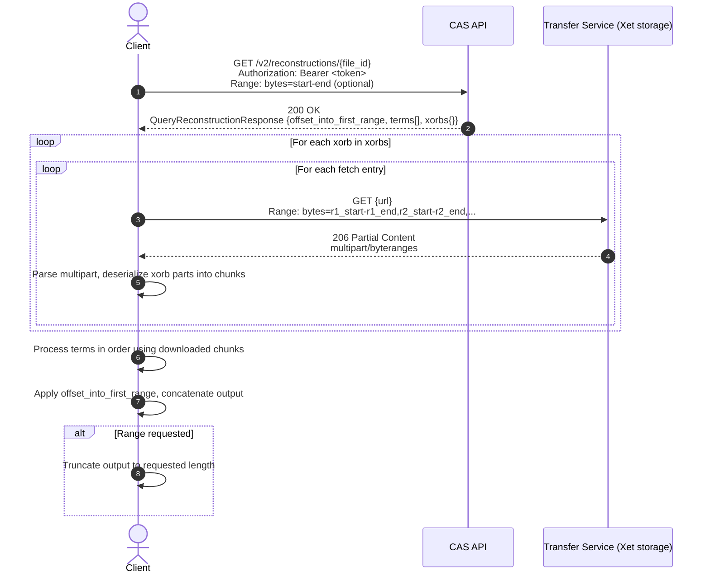

# Download Protocol

This document describes the complete process of downloading a single file from the Xet protocol using the Content Addressable Storage (CAS) reconstruction API.

## Overview

File download in the Xet protocol is a two-stage process:

1. **Reconstruction Query**: Query the CAS API to get file reconstruction metadata
2. **Data Fetching**: Download and reassemble the file using the reconstruction metadata

## Stage 1: Calling the Reconstruction API

### Single File Reconstruction

To download a file given a file hash, first call the reconstruction API to get the file reconstruction. Follow the steps in [api](./api#1-get-file-reconstruction).

Note that you will need at least a `read` scope auth token, [auth reference](./auth).

> [!TIP]
> For large files it is RECOMMENDED to request the reconstruction in batches i.e. the first 10GB, download all the data, then the next 10GB and so on. Clients can use the `Range` header to specify a range of file data.

## Stage 2: Understanding the Reconstruction Response

The reconstruction API returns a `QueryReconstructionResponse` object with three key components:

### QueryReconstructionResponse Structure

```json
{
  "offset_into_first_range": 0,
  "terms": [
    {
      "hash": "a1b2c3d4e5f6789012345678901234567890abcdef1234567890abcdef123456",
      "unpacked_length": 263873,
      "range": {
        "start": 0,
        "end": 4
      }
    },
    ...
  ],
  "xorbs": {
    "a1b2c3d4e5f6789012345678901234567890abcdef1234567890abcdef123456": [
      {
        "url": "https://transfer.xethub.hf.co/xorb/default/a1b2c3d4...?<signed-params>",
        "ranges": [
          {
            "chunks": { "start": 0, "end": 4 },
            "bytes": { "start": 0, "end": 131071 }
          }
        ]
      }
    ],
    ...
  }
}
```

### Fields

#### offset_into_first_range

- Type: `number`
- For a full file or when the specified range start is 0, then this is guaranteed to be `0`
- For range queries this is the byte offset into the first term (deserialized/chunks decompressed) to start to keep data from.
  - since the requested range may start in the middle of a chunk, and data MUST be downloaded in full chunks (since they may need to be deserialized) then this offset tells a client how many bytes to skip in the first chunk (or possibly multiple chunks within the first term).

#### terms

- Type: `Array<CASReconstructionTerm>`
- Ordered list of reconstruction terms describing what chunks to download from which xorb
- Each `CASReconstructionTerm` contains:
  - `hash`: The xorb hash (64-character lowercase hex string)
  - `range`: Chunk index range `{ start: number, end: number }` within the xorb; end-exclusive `[start, end)`
  - `unpacked_length`: Expected length after decompression (for validation)

#### xorbs

- Type: `Map<Xorb Hash (64 character lowercase hex string), Array<XorbMultiRangeFetch>>`
- Maps xorb hashes to a list of multi-range fetch entries.
- Typically 1 entry per xorb. Multiple entries only when the URL would exceed the URL length limit.
- Each `XorbMultiRangeFetch` contains:
  - `url`: Signed URL with all byte ranges encoded. The client MUST send exactly the signed range value as the `Range` header.
  - `ranges`: Array of `XorbRangeDescriptor`, sorted by chunk start. Each descriptor contains:
    - `chunks`: Chunk index range `{ start: number, end: number }`; end-exclusive `[start, end)`
    - `bytes`: Physical byte range `{ start: number, end: number }` for the HTTP Range header; end-inclusive `[start, end]`

> [!IMPORTANT]
> The URL encodes the exact set of byte ranges that MUST be requested. Requesting individual sub-ranges separately will result in an authorization failure. The client MUST send all ranges from a single `XorbMultiRangeFetch` entry in a single request.

## Stage 3: Downloading and Reconstructing the File

### Process Overview

1. For each entry in the `xorbs` map, download xorb data using multi-range HTTP requests
2. Process each `CASReconstructionTerm` in order from the `terms` array, using the downloaded chunk data
3. (for the first term only) skip `offset_into_first_range` bytes
4. Concatenate the results in term order to reconstruct the file

> [!TIP]
> Clients MAY interleave downloading and processing to reduce memory usage, as long as terms are assembled in order. It is not necessary to download all xorb data before processing terms.

### Detailed Download Process

#### Step 1: Download Reconstruction

Use the reconstruction API to download the reconstruction object for a given file.

```python
file_id = "0123...abcdef"
api_endpoint, token = get_token() # follow auth instructions
url = api_endpoint + "/v2/reconstructions/" + file_id
reconstruction = get(url, headers={"Authorization": "Bearer " + token})

# break the reconstruction into components
terms = reconstruction["terms"]
xorbs = reconstruction["xorbs"]
offset_into_first_range = reconstruction["offset_into_first_range"]
```

#### Step 2: Download Xorb Data

For each xorb, for each fetch entry, send a single multi-range HTTP GET request:

1. Build the `Range` header from all `bytes` ranges: `Range: bytes=0-131071,500000-600000`
2. Send a single HTTP `GET` request to the `url` with this `Range` header
3. If there is a single range, the response is a `206 Partial Content` with the xorb data directly
4. If there are multiple ranges, the response is a `206 Partial Content` with `Content-Type: multipart/byteranges`. Parse each part to get the xorb data for each range.
5. Deserialize each part as xorb data to extract chunks

```python
# Download all xorb data upfront
downloaded_chunks = {}  # (xorb_hash, chunk_index) -> chunk_data

for xorb_hash, fetch_entries in xorbs.items():
  for fetch_entry in fetch_entries:
    url = fetch_entry["url"]
    ranges = fetch_entry["ranges"]

    # Build multi-range header
    range_parts = [f'{r["bytes"]["start"]}-{r["bytes"]["end"]}' for r in ranges]
    range_header = "bytes=" + ",".join(range_parts)

    response = get(url, headers={"Range": range_header})

    # Parse response (multipart/byteranges if multiple ranges)
    parts = parse_multipart_response(response) if len(ranges) > 1 else [response.content]

    for part, range_desc in zip(parts, ranges):
      # Deserialize xorb data to extract chunks
      for i in range(range_desc["chunks"]["start"], range_desc["chunks"]["end"]):
        chunk = deserialize_chunk(part)
        downloaded_chunks[(xorb_hash, i)] = chunk
```

#### Step 3: Extract Term Data and Reconstruct

Process the `terms` array in order, using the downloaded chunk data:

```python
file_chunks = []
for term in terms:
  xorb_hash = term["hash"]
  for i in range(term["range"]["start"], term["range"]["end"]):
    chunk = downloaded_chunks[(xorb_hash, i)]

    # skip offset_into_first_range bytes from the beginning
    if offset_into_first_range > len(chunk):
      offset_into_first_range -= len(chunk)
      continue
    if offset_into_first_range > 0:
      chunk = chunk[offset_into_first_range:]
      offset_into_first_range = 0

    file_chunks.append(chunk)
```

#### Step 4: Stitch Results Together

Write all of the chunks to the output file or buffer.

If a range was specified then the total data will need to be truncated to the amount of bytes requested.
When a range is specified but the range does not end on a chunk boundary the last byte of the requested range will be in the middle of the last chunk.
A client knows the start of the data from `offset_into_first_range` and can then use the length of the specified range to know the end offset.

```python
with open(file_path) as f:
  for chunk in file_chunks:
    f.write(chunk)
```

## Range Downloads

For partial file downloads, the reconstruction API supports range queries:

- Include `Range: bytes=start-end` header in the reconstruction request
- The `offset_into_first_range` field indicates where your range starts within the first term
- The end of the content will need to be truncated to fit the requested range.
  - Except if the requested range exceeds the total file length, then the returned content will be shorter and no truncation is necessary.

When downloading xorb data:

A client MUST include the `Range` header formed with the byte range values from the `XorbMultiRangeFetch` entry. The signed URL authorizes access only to the specific ranges listed. Not specifying the correct `Range` header will result in an authorization failure.

## Performance Considerations

- **Fewer HTTP requests**: Multiple byte ranges for the same xorb are combined into a single URL, allowing one HTTP request per xorb instead of one per chunk range
- **Parallel downloads**: Xorb data can be downloaded in parallel, but terms MUST be assembled in order
  - On file systems with fast seeking, it MAY be advantageous to open the output file in different threads and writing contents at different offsets
- **Caching**: Clients SHOULD consider caching downloaded xorb ranges to avoid redundant requests
- **Retry logic**: Implement exponential backoff for transient failures

### Caching recommendations

1. It can be ineffective to cache the reconstruction object
    1. The xorbs section provides short-expiration pre-signed URLs hence clients SHOULD NOT cache the URLs beyond their short expiration
    2. To get those URLs to access the data you will need to call the reconstruction API again anyway
2. Cache chunks by range not just individually
    1. If you need a chunk from a xorb it is very likely that you will need another, so cache them close
3. Caching helps when downloading similar contents. May not be worth to cache data if you are always downloading different things

## More complex QueryReconstruction Example

Here's an example of a `QueryReconstructionResponse` that shows how file reconstruction works across multiple xorbs:

```json
{
  "offset_into_first_range": 0,
  "terms": [
    {
      "hash": "a1b2c3d4e5f6789012345678901234567890abcdef1234567890abcdef123456",
      "unpacked_length": 263873,
      "range": {
        "start": 1,
        "end": 4
      }
    },
    {
      "hash": "fedcba0987654321098765432109876543210fedcba098765432109876543",
      "unpacked_length": 143890,
      "range": {
        "start": 0,
        "end": 3
      }
    },
    {
      "hash": "a1b2c3d4e5f6789012345678901234567890abcdef1234567890abcdef123456",
      "unpacked_length": 3063572,
      "range": {
        "start": 3,
        "end": 43
      }
    }
  ],
  "xorbs": {
    "a1b2c3d4e5f6789012345678901234567890abcdef1234567890abcdef123456": [
      {
        "url": "https://transfer.xethub.hf.co/xorb/default/a1b2c3d4...?<signed-params>",
        "ranges": [
          {
            "chunks": { "start": 1, "end": 43 },
            "bytes": { "start": 57980, "end": 1433008 }
          }
        ]
      }
    ],
    "fedcba0987654321098765432109876543210fedcba098765432109876543": [
      {
        "url": "https://transfer.xethub.hf.co/xorb/default/fedcba09...?<signed-params>",
        "ranges": [
          {
            "chunks": { "start": 0, "end": 3 },
            "bytes": { "start": 0, "end": 65670 }
          }
        ]
      }
    ]
  }
}
```

This example shows reconstruction of a file that requires:

- Chunks `[1, 4)` from the first xorb (~264KB of unpacked data)
- Chunks `[0, 3)` from the second xorb (~144KB of unpacked data)
- Chunks `[3, 43)` from the first xorb again (~3MB of unpacked data)

The `xorbs` map provides signed URLs and byte ranges needed to download the chunk data from each xorb. The `chunks` ranges are always end-exclusive i.e. `{ "start": 0, "end": 3 }` is a range of 3 chunks at indices 0, 1 and 2.
The `bytes` ranges are end-inclusive and used to form the `Range` header when downloading.
A `"bytes"` value of `{ "start": X, "end": Y }` creates a `Range` header value of `bytes=X-Y`.

When downloading and deserializing the chunks from xorb `a1b2c3d4...` we get chunks at indices `[1, 43)`.
We use chunks `[1, 4)` to fulfill the first term, then chunks `[3, 43)` to fulfill the third term.
Note that chunk at index 3 is used twice! This is the benefit of deduplication; we only need to download the chunk content once.

## Diagram


```mermaid
sequenceDiagram
  autonumber
  actor client as Client
  participant S as CAS API
  participant Transfer as Transfer Service (Xet storage)

  client->>S: GET /v2/reconstructions/{file_id}<br/>Authorization: Bearer <token><br/>Range: bytes=start-end (optional)
  S-->>client: 200 OK<br/>QueryReconstructionResponse {offset_into_first_range, terms[], xorbs{}}

  loop For each xorb in xorbs
    loop For each fetch entry
      client->>Transfer: GET {url}<br/>Range: bytes=r1_start-r1_end,r2_start-r2_end,...
      Transfer-->>client: 206 Partial Content<br/>multipart/byteranges
      client->>client: Parse multipart, deserialize xorb parts into chunks
    end
  end

  client->>client: Process terms in order using downloaded chunks
  client->>client: Apply offset_into_first_range, concatenate output

  alt Range requested
    client->>client: Truncate output to requested length
  end
```
