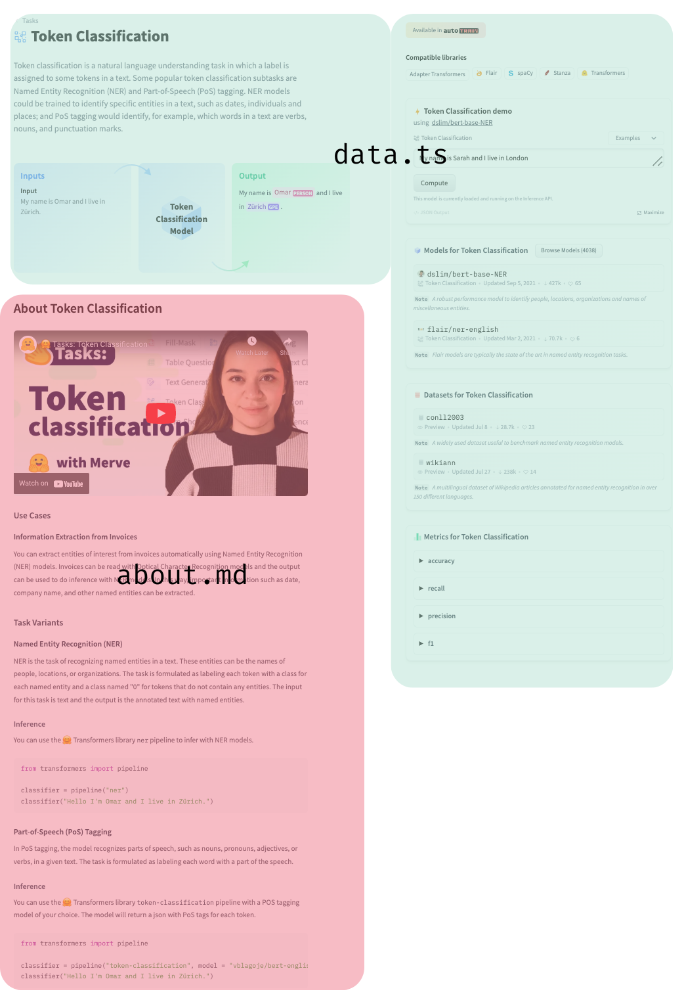
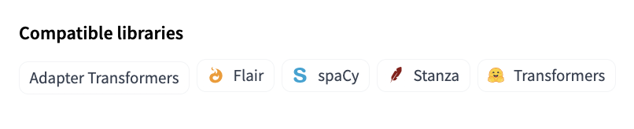
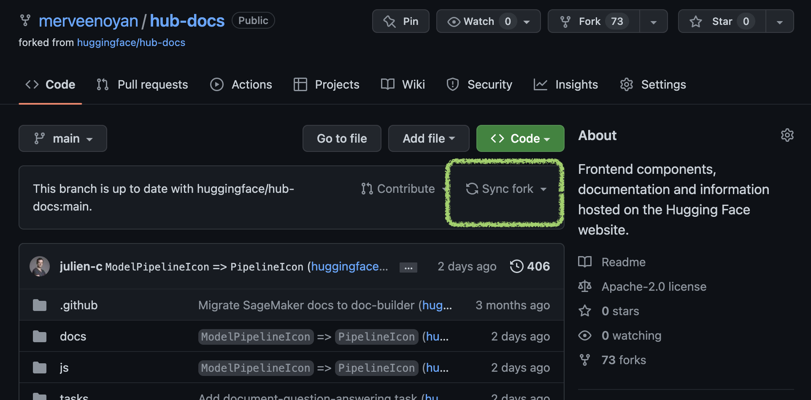
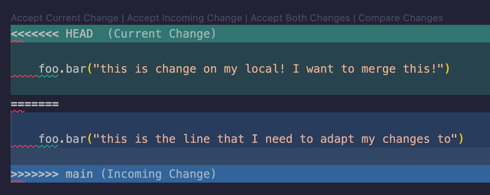

## Contributing to Tasks

Welcome to the contribution guide to [Hugging Face Tasks](https://huggingface.co/tasks) and thank you for considering contributing to the community!

### Philosophy behind Tasks

The Task pages are made to lower the barrier of entry to understand a task that can be solved with machine learning and use or train a model to accomplish it. It's a collaborative documentation effort made to help out software developers, social scientists, or anyone with no background in machine learning that is interested in understanding how machine learning models can be used to solve a problem. 

The task pages avoid jargon to let everyone understand the documentation, and if specific terminology is needed, it is explained on the most basic level possible. This is important to understand before contributing to Tasks: at the end of every task page, the user is expected to be able to find and pull a model from the Hub and use it on their data and see if it works for their use case to come up with a proof of concept.

### How to Contribute
You can open a pull request to [hub-docs repository](https://github.com/huggingface/hub-docs) to contribute a new documentation about a new task. Under `tasks/src` we have a folder for every task that contains two files, `about.md` and `data.ts`. `about.md` contains the markdown part of the page, use cases, resources and minimal code block to infer a model that belongs to the task. `data.ts` contains redirections to canonical models and datasets, metrics, the schema of the task and the information the inference widget needs. 

We have `tasks/assets` that contains data used in the inference widget and images used in the markdown file. The last file is `const.ts`, which has the task to library mapping (e.g. spacy to token-classification) where you can add a library. They will look in the top right corner like below.

This might seem overwhelming, but you don't necessarily need to add all of these in one pull request or on your own, you can simply contribute one section. Feel free to ask for help whenever you need. 

### I have a merge conflict, what now! 😱
So essentially what happens is that you were trying to write your changes to this repository's main branch. However, since you opened the PR, some changes occurred to that branch. Because of this, there's a conflict. Git says that "for fifth line of the code you wanted to write this, but this line is now changed, so it's better if you adapt your changes on top of these changes".

Because you're working on a fork of original repository, first you need to have the changes (for main branch) To do so, simply sync your fork first:

Then on your local repository, do a `git pull` while you're on main branch of your fork. Then, merge changes from main branch to the branches that your PRs are based on, so that those branches are updated too! This will bring the changes on your local and raise a merge conflict that you can solve through your IDE. It looks like below:

Depending on accepting or rejecting incoming changes, the final version of the final will be shaped, and that's all you need to do if you want to keep or discard a change. It's encouraged that you respect other contributors' contributions and append your changes on top of theirs. (Unless it's a fix!)

Once you resolve the conflicts, simply add, commit and push your changes.